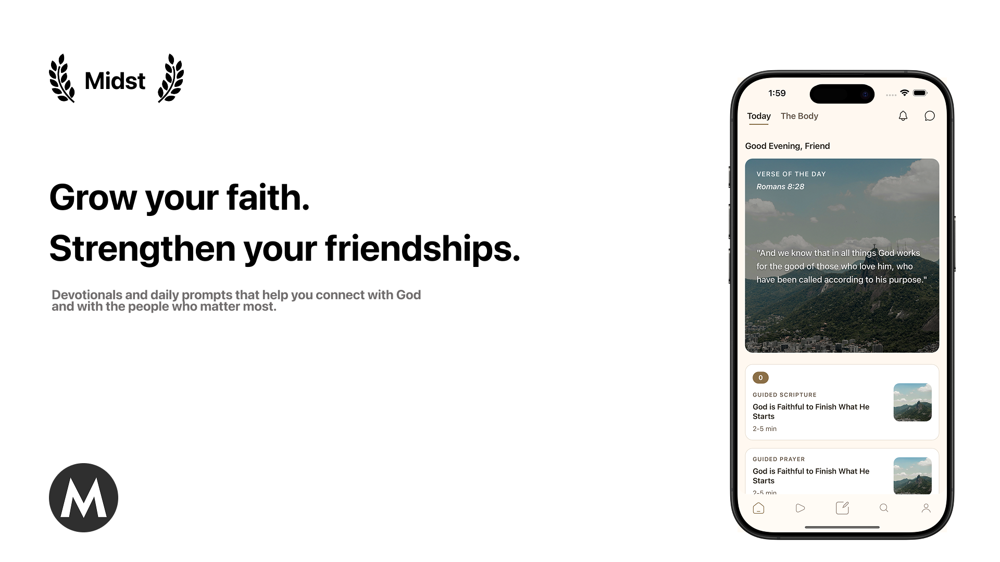

# Midst — Christian Devotional & Community App

**Midst** is a Christian mobile app designed to help users grow in their faith through daily devotionals, Scripture reflections, and meaningful friend connections. It provides a calm, modern space for believers to share encouragement, track spiritual moments, and stay connected through prayer.

  

---

## Overview

Midst focuses on three main areas:

- Daily devotionals and Scripture readings  
- Friend-to-friend encouragement and shared spiritual moments  
- A simple, peaceful UI that supports reflection and connection  

The app is currently in development, with core features being prototyped and refined.

---

## Tech Stack

- **React Native**, **Expo**, **TypeScript**  
- **Firebase** (Auth, Firestore, Cloud Storage)  
- **Tailwind (NativeWind)** for styling  
- **Zustand/Redux** for state management  

---

## Current Work

- Developing the devotional reader and saving system  
- Implementing friend connections and encouragement flows  
- Prototyping UI components and navigation  
- Integrating Firebase authentication and database structure  

---

## Vision

Midst aims to blend faith and community by helping users stay rooted in Scripture while staying connected to the people who support their walk with Christ.

